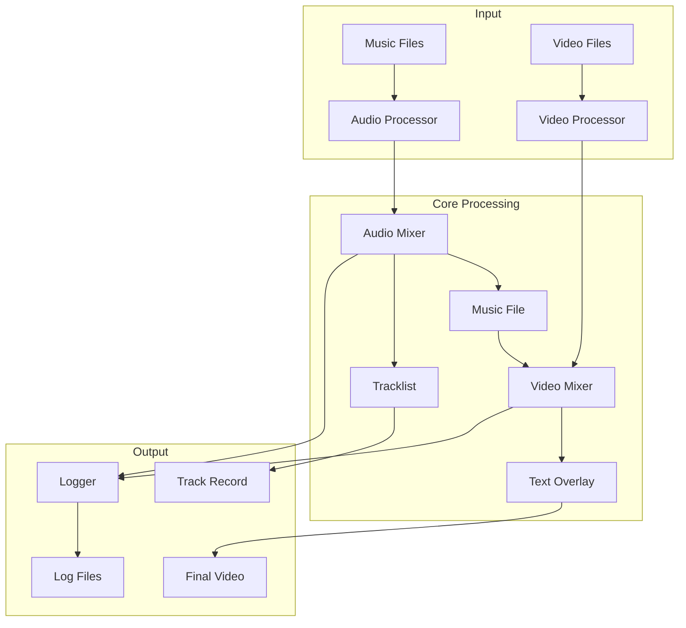
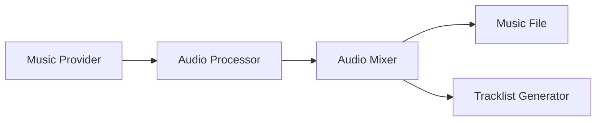
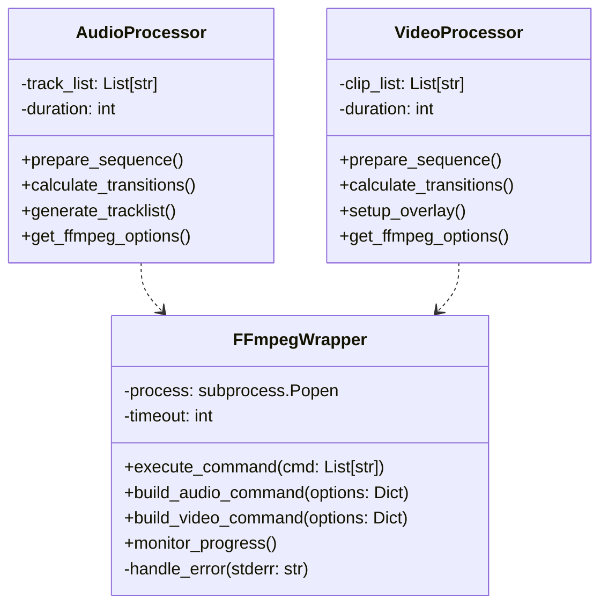
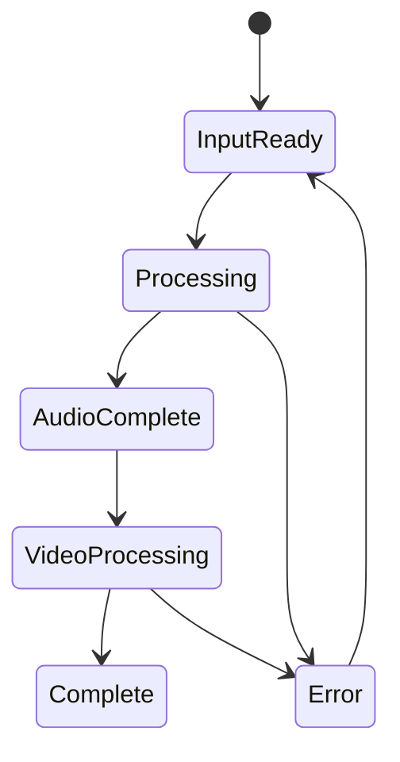

# System Patterns

Last Updated: 2025-03-07

## Purpose
This document outlines the system architecture, key technical decisions, design patterns in use, and component relationships.

## System Architecture


## Core Design Patterns
### Factory Pattern
- AudioProcessorFactory for audio handling
- VideoProcessorFactory for video handling
- TransitionFactory for effect management

### Strategy Pattern
- Different transition strategies
- Various text overlay styles
- Multiple logging levels

### Observer Pattern
- Progress monitoring
- Event logging
- State changes notification

## Component Relationships
### Audio Processing Chain


### Video Processing Chain


## Technical Decisions
### Python as Core Language
- Strong multimedia processing libraries
- Excellent ffmpeg bindings
- Good testing frameworks
- Cloud deployment ready

### File-Based Architecture
- Clear separation of input/output
- Easy to test and verify
- Cloud storage compatible
- Simple state management

### ffmpeg Integration
#### Core Architecture


#### Implementation Strategy
```python
class FFmpegWrapper:
    """Central FFmpeg operations manager"""
    def __init__(self, ffmpeg_path=None, ffprobe_path=None, timeout=None):
        self.ffmpeg_path = ffmpeg_path or str(Config.FFMPEG_PATH)
        self.ffprobe_path = ffprobe_path or str(Config.FFPROBE_PATH)
        self.timeout = timeout
        self.logger = logging.getLogger('FFmpegWrapper')

    def _run_command(self, command):
        """Runs an FFmpeg command using subprocess"""
        try:
            self.logger.info(f"Running command: {' '.join(command)}")
            result = subprocess.run(
                command,
                stdout=subprocess.PIPE,
                stderr=subprocess.PIPE,
                text=True,
                timeout=self.timeout
            )
            self.logger.info(result.stdout)
            if result.returncode != 0:
                self.logger.error(f"FFmpeg command failed with error: {result.stderr}")
                return None
            return result
        except FileNotFoundError:
            self.logger.error("FFmpeg executable not found")
            return None
        except subprocess.TimeoutExpired:
            self.logger.error(f"FFmpeg command timed out after {self.timeout} seconds")
            return None
        except Exception as e:
            self.logger.error(f"An unexpected error occurred: {e}")
            return None

    def build_audio_command(self, options):
        """Optimized audio processing command"""
        return [
            'ffmpeg',
            '-f', 'concat',
            '-safe', '0',
            '-i', options['input_list'],
            '-c', 'copy',  # Stream copy for efficiency
            options['output_file']
        ]

    def build_video_command(self, options):
        """H.264 optimized video processing"""
        return [
            'ffmpeg',
            '-i', options['input_file'],
            '-c:v', 'libx264',
            '-preset', options.get('preset', 'medium'),  # Balanced preset
            '-crf', '23',  # High quality, reasonable size
            '-tune', 'film',  # Optimized for video content
            '-movflags', '+faststart',  # Web playback optimization
            '-profile:v', 'high',  # High profile for better quality
            '-level', '4.1',  # Widely compatible level
            options['output_file']
        ]

    def get_video_dimensions(self, file_path):
        """Gets the dimensions of a video file using ffprobe"""
        try:
            command = [
                self.ffprobe_path,
                "-v", "error",
                "-select_streams", "v:0",
                "-show_entries", "stream=width,height",
                "-of", "json",
                file_path
            ]
            
            result = subprocess.run(command, capture_output=True, text=True, check=True)
            import json
            data = json.loads(result.stdout)
            return (int(data["streams"][0]["width"]), 
                   int(data["streams"][0]["height"]))
        except Exception as e:
            self.logger.error(f"Error getting video dimensions: {e}")
            return None

class TransitionHandler:
    """Handles video transitions and effects"""
    def __init__(self, ffmpeg_wrapper):
        self.ffmpeg = ffmpeg_wrapper
        self.transition_length = 2.0  # seconds
        self.resolution = (1920, 1080)  # target resolution
        
    def apply_transition(self, clip1, clip2, transition_type='fade'):
        """Applies transition between two clips"""
        # Get dimensions for both clips
        dim1 = self.ffmpeg.get_video_dimensions(clip1)
        dim2 = self.ffmpeg.get_video_dimensions(clip2)
        
        # Scale clips to target resolution
        scaled1 = self._scale_video(clip1, dim1)
        scaled2 = self._scale_video(clip2, dim2)
        
        # Apply transition effect
        if transition_type == 'fade':
            return self._apply_fade_transition(scaled1, scaled2)
        elif transition_type == 'dissolve':
            return self._apply_dissolve_transition(scaled1, scaled2)
        else:
            return self._apply_cut(scaled1, scaled2)
            
    def _scale_video(self, clip, dimensions):
        """Scales video to target resolution"""
        if dimensions == self.resolution:
            return clip
            
        options = {
            'input_file': clip,
            'output_file': f'temp_{os.path.basename(clip)}',
            'vf': f'scale={self.resolution[0]}:{self.resolution[1]}'
        }
        return self.ffmpeg.build_video_command(options)
            
    def _apply_fade_transition(self, clip1, clip2):
        """Creates a fade transition between clips"""
        options = {
            'input_file': clip1,
            'output_file': 'transition.mp4',
            'filter_complex': f'[0:v]fade=t=out:st={self.transition_length}:d=1[v1];' \
                            f'[1:v]fade=t=in:st=0:d=1[v2];' \
                            f'[v1][v2]concat=n=2:v=1:a=0'
        }
        return self.ffmpeg.build_video_command(options)

    def _apply_dissolve_transition(self, clip1, clip2):
        """Creates a dissolve/crossfade transition"""
        options = {
            'input_file': clip1,
            'input_file2': clip2,
            'output_file': 'transition.mp4',
            'filter_complex': f'[0:v][1:v]xfade=transition=fade:duration={self.transition_length}'
        }
        return self.ffmpeg.build_video_command(options)

class TextOverlay:
    """Handles text overlays on video"""
    def __init__(self, ffmpeg_wrapper):
        self.ffmpeg = ffmpeg_wrapper
        self.font = "Arial"
        self.font_size = 24
        self.color = "white"
        
    def add_text(self, video_file, text, position="bottom", duration=None):
        """Adds text overlay to video"""
        # Calculate text position
        if position == "bottom":
            y_pos = "(h-text_h-20)"
        elif position == "top":
            y_pos = "20"
        else:
            y_pos = "(h-text_h)/2"
            
        # Build drawtext filter
        drawtext = f"drawtext=text='{text}':fontfile={self.font}:" \
                  f"fontsize={self.font_size}:fontcolor={self.color}:" \
                  f"x=(w-text_w)/2:y={y_pos}"
                  
        if duration:
            drawtext += f":enable='between(t,0,{duration})'"
            
        options = {
            'input_file': video_file,
            'output_file': f'text_{os.path.basename(video_file)}',
            'vf': drawtext
        }
        return self.ffmpeg.build_video_command(options)

class ProgressMonitor:
    """Real-time FFmpeg progress tracking"""
    def __init__(self, total_duration):
        self.total_duration = total_duration
        self.start_time = time.time()
        self.current_time = 0
        self.estimated_total = 0
        
    def parse_progress(self, line):
        """Parse FFmpeg output for progress information"""
        patterns = {
            'time': r'time=(\d{2}:\d{2}:\d{2})',
            'frame': r'frame=\s*(\d+)',
            'fps': r'fps=\s*(\d+\.?\d*)',
            'size': r'size=\s*(\d+)kB',
            'bitrate': r'bitrate=\s*(\d+\.\d+)kbits/s'
        }
        
        result = {}
        for key, pattern in patterns.items():
            if match := re.search(pattern, line):
                result[key] = match.group(1)
                
        if 'time' in result:
            self._calculate_eta(result['time'])
        
        return result
        
    def _calculate_eta(self, time_str):
        """Calculate estimated time remaining"""
        h, m, s = map(int, time_str.split(':'))
        self.current_time = h * 3600 + m * 60 + s
        
        if self.current_time > 0:
            elapsed = time.time() - self.start_time
            self.estimated_total = (elapsed * self.total_duration) / self.current_time
            
        return self.estimated_total - elapsed if 'elapsed' in locals() else None

    def get_progress(self):
        """Get current progress as percentage"""
        if self.total_duration > 0:
            return (self.current_time / self.total_duration) * 100
        return 0
```
# System Patterns

Last Updated: 2025-03-07

## Purpose
This document outlines the system architecture, key technical decisions, design patterns in use, and component relationships.

## System Architecture


## Core Design Patterns
### Factory Pattern
- AudioProcessorFactory for audio handling
- VideoProcessorFactory for video handling
- TransitionFactory for effect management

### Strategy Pattern
- Different transition strategies
- Various text overlay styles
- Multiple logging levels

### Observer Pattern
- Progress monitoring
- Event logging
- State changes notification

## Component Relationships
### Audio Processing Chain


### Video Processing Chain


## Technical Decisions
### Python as Core Language
- Strong multimedia processing libraries
- Excellent ffmpeg bindings
- Good testing frameworks
- Cloud deployment ready

### File-Based Architecture
- Clear separation of input/output
- Easy to test and verify
- Cloud storage compatible
- Simple state management

### ffmpeg Integration
#### Core Architecture


#### Implementation Strategy
```python
class FFmpegWrapper:
    """Central FFmpeg operations manager"""
    def __init__(self, ffmpeg_path=None, ffprobe_path=None, timeout=None):
        self.ffmpeg_path = ffmpeg_path or str(Config.FFMPEG_PATH)
        self.ffprobe_path = ffprobe_path or str(Config.FFPROBE_PATH)
        self.timeout = timeout
        self.logger = logging.getLogger('FFmpegWrapper')

    def _run_command(self, command):
        """Runs an FFmpeg command using subprocess"""
        try:
            self.logger.info(f"Running command: {' '.join(command)}")
            result = subprocess.run(
                command,
                stdout=subprocess.PIPE,
                stderr=subprocess.PIPE,
                text=True,
                timeout=self.timeout
            )
            self.logger.info(result.stdout)
            if result.returncode != 0:
                self.logger.error(f"FFmpeg command failed with error: {result.stderr}")
                return None
            return result
        except FileNotFoundError:
            self.logger.error("FFmpeg executable not found")
            return None
        except subprocess.TimeoutExpired:
            self.logger.error(f"FFmpeg command timed out after {self.timeout} seconds")
            return None
        except Exception as e:
            self.logger.error(f"An unexpected error occurred: {e}")
            return None

    def build_audio_command(self, options):
        """Optimized audio processing command"""
        return [
            'ffmpeg',
            '-f', 'concat',
            '-safe', '0',
            '-i', options['input_list'],
            '-c', 'copy',  # Stream copy for efficiency
            options['output_file']
        ]

    def build_video_command(self, options):
        """H.264 optimized video processing"""
        return [
            'ffmpeg',
            '-i', options['input_file'],
            '-c:v', 'libx264',
            '-preset', options.get('preset', 'medium'),  # Balanced preset
            '-crf', '23',  # High quality, reasonable size
            '-tune', 'film',  # Optimized for video content
            '-movflags', '+faststart',  # Web playback optimization
            '-profile:v', 'high',  # High profile for better quality
            '-level', '4.1',  # Widely compatible level
            options['output_file']
        ]

    def get_video_dimensions(self, file_path):
        """Gets the dimensions of a video file using ffprobe"""
        try:
            command = [
                self.ffprobe_path,
                "-v", "error",
                "-select_streams", "v:0",
                "-show_entries", "stream=width,height",
                "-of", "json",
                file_path
            ]
            
            result = subprocess.run(command, capture_output=True, text=True, check=True)
            import json
            data = json.loads(result.stdout)
            return (int(data["streams"][0]["width"]), 
                   int(data["streams"][0]["height"]))
        except Exception as e:
            self.logger.error(f"Error getting video dimensions: {e}")
            return None

class TransitionHandler:
    """Handles video transitions and effects"""
    def __init__(self, ffmpeg_wrapper):
        self.ffmpeg = ffmpeg_wrapper
        self.transition_length = 2.0  # seconds
        self.resolution = (1920, 1080)  # target resolution
        
    def apply_transition(self, clip1, clip2, transition_type='fade'):
        """Applies transition between two clips"""
        # Get dimensions for both clips
        dim1 = self.ffmpeg.get_video_dimensions(clip1)
        dim2 = self.ffmpeg.get_video_dimensions(clip2)
        
        # Scale clips to target resolution
        scaled1 = self._scale_video(clip1, dim1)
        scaled2 = self._scale_video(clip2, dim2)
        
        # Apply transition effect
        if transition_type == 'fade':
            return self._apply_fade_transition(scaled1, scaled2)
        elif transition_type == 'dissolve':
            return self._apply_dissolve_transition(scaled1, scaled2)
        else:
            return self._apply_cut(scaled1, scaled2)
            
    def _scale_video(self, clip, dimensions):
        """Scales video to target resolution"""
        if dimensions == self.resolution:
            return clip
            
        options = {
            'input_file': clip,
            'output_file': f'temp_{os.path.basename(clip)}',
            'vf': f'scale={self.resolution[0]}:{self.resolution[1]}'
        }
        return self.ffmpeg.build_video_command(options)
            
    def _apply_fade_transition(self, clip1, clip2):
        """Creates a fade transition between clips"""
        options = {
            'input_file': clip1,
            'output_file': 'transition.mp4',
            'filter_complex': f'[0:v]fade=t=out:st={self.transition_length}:d=1[v1];' \
                            f'[1:v]fade=t=in:st=0:d=1[v2];' \
                            f'[v1][v2]concat=n=2:v=1:a=0'
        }
        return self.ffmpeg.build_video_command(options)

    def _apply_dissolve_transition(self, clip1, clip2):
        """Creates a dissolve/crossfade transition"""
        options = {
            'input_file': clip1,
            'input_file2': clip2,
            'output_file': 'transition.mp4',
            'filter_complex': f'[0:v][1:v]xfade=transition=fade:duration={self.transition_length}'
        }
        return self.ffmpeg.build_video_command(options)

class TextOverlay:
    """Handles text overlays on video"""
    def __init__(self, ffmpeg_wrapper):
        self.ffmpeg = ffmpeg_wrapper
        self.font = "Arial"
        self.font_size = 24
        self.color = "white"
        
    def add_text(self, video_file, text, position="bottom", duration=None):
        """Adds text overlay to video"""
        # Calculate text position
        if position == "bottom":
            y_pos = "(h-text_h-20)"
        elif position == "top":
            y_pos = "20"
        else:
            y_pos = "(h-text_h)/2"
            
        # Build drawtext filter
        drawtext = f"drawtext=text='{text}':fontfile={self.font}:" \
                  f"fontsize={self.font_size}:fontcolor={self.color}:" \
                  f"x=(w-text_w)/2:y={y_pos}"
                  
        if duration:
            drawtext += f":enable='between(t,0,{duration})'"
            
        options = {
            'input_file': video_file,
            'output_file': f'text_{os.path.basename(video_file)}',
            'vf': drawtext
        }
        return self.ffmpeg.build_video_command(options)

class ProgressMonitor:
    """Real-time FFmpeg progress tracking"""
    def __init__(self, total_duration):
        self.total_duration = total_duration
        self.start_time = time.time()
        self.current_time = 0
        self.estimated_total = 0
        
    def parse_progress(self, line):
        """Parse FFmpeg output for progress information"""
        patterns = {
            'time': r'time=(\d{2}:\d{2}:\d{2})',
            'frame': r'frame=\s*(\d+)',
            'fps': r'fps=\s*(\d+\.?\d*)',
            'size': r'size=\s*(\d+)kB',
            'bitrate': r'bitrate=\s*(\d+\.\d+)kbits/s'
        }
        
        result = {}
        for key, pattern in patterns.items():
            if match := re.search(pattern, line):
                result[key] = match.group(1)
                
        if 'time' in result:
            self._calculate_eta(result['time'])
        
        return result
        
    def _calculate_eta(self, time_str):
        """Calculate estimated time remaining"""
        h, m, s = map(int, time_str.split(':'))
        self.current_time = h * 3600 + m * 60 + s
        
        if self.current_time > 0:
            elapsed = time.time() - self.start_time
            self.estimated_total = (elapsed * self.total_duration) / self.current_time
            
        return self.estimated_total - elapsed if 'elapsed' in locals() else None

    def get_progress(self):
        """Get current progress as percentage"""
        if self.total_duration > 0:
            return (self.current_time / self.total_duration) * 100
        return 0
```

#### Separation of Concerns
1. FFmpegWrapper
   - All FFmpeg command construction
   - Process management
   - GPU acceleration handling
   - Error management

2. AudioProcessor
   - Track sequence management
   - Transition timing
   - Metadata handling
   - No direct FFmpeg calls

3. VideoProcessor
   - Clip sequence management
   - Visual transitions
   - Overlay handling
   - No direct FFmpeg calls

#### Performance Optimizations
1. Video Encoding
   - libx264 with optimized settings
   - CRF-based quality control
   - Film-tuned encoding
   - Web playback optimization

2. Resource Management
   - Chunked processing
   - Stream copying
   - Memory-aware operations

#### Error Handling
- Centralized in FFmpegWrapper
- Process cleanup guaranteed
- GPU support detection
- Structured error reporting

## Data Flow
### Audio Pipeline
1. Scan music directory
2. Randomize track order
3. Process audio metadata
4. Generate transitions
5. Create unified track
6. Generate tracklist

### Video Pipeline
1. Scan clips directory
2. Create clip sequence
3. Apply transitions
4. Overlay track names
5. Generate final video

## State Management
### File System States


## Error Handling
### Recovery Strategies
- Input validation before processing
- Temporary file cleanup
- Partial progress preservation
- Detailed error logging

### Error Types
- Input file errors
- Processing failures
- Resource constraints
- Integration issues

## Performance Considerations
- Batch process audio files
- Stream video processing
- Minimize file operations
- Optimize memory usage
- Use ffmpeg hardware acceleration

## Security Patterns
- Input file validation
- Resource usage limits
- Secure file operations
- Clean error messages
- Safe external calls

## Testing Strategy
### Unit Testing
- Component isolation
- Mock file operations
- Test configurations
- Error conditions

### Integration Testing
- End-to-end flows
- File handling
- ffmpeg integration
- Performance metrics

### Test Coverage Goals
- Core logic: 90%+
- File handlers: 85%+
- Integration points: 80%+

## Notes
- This document should reflect current implementation patterns
- Update when introducing new patterns or changing existing ones
- Architecture decisions here should align with techContext.md
# System Patterns

Last Updated: 2025-03-07

## Purpose
This document outlines the system architecture, key technical decisions, design patterns in use, and component relationships.

## System Architecture


## Core Design Patterns
### Factory Pattern
- AudioProcessorFactory for audio handling
- VideoProcessorFactory for video handling
- TransitionFactory for effect management

### Strategy Pattern
- Different transition strategies
- Various text overlay styles
- Multiple logging levels

### Observer Pattern
- Progress monitoring
- Event logging
- State changes notification

## Component Relationships
### Audio Processing Chain


### Video Processing Chain


## Technical Decisions
### Python as Core Language
- Strong multimedia processing libraries
- Excellent ffmpeg bindings
- Good testing frameworks
- Cloud deployment ready

### File-Based Architecture
- Clear separation of input/output
- Easy to test and verify
- Cloud storage compatible
- Simple state management

### ffmpeg Integration
#### Core Architecture


#### Implementation Strategy
```python
class FFmpegWrapper:
    """Central FFmpeg operations manager"""
    def __init__(self, ffmpeg_path=None, ffprobe_path=None, timeout=None):
        self.ffmpeg_path = ffmpeg_path or str(Config.FFMPEG_PATH)
        self.ffprobe_path = ffprobe_path or str(Config.FFPROBE_PATH)
        self.timeout = timeout
        self.logger = logging.getLogger('FFmpegWrapper')

    def _run_command(self, command):
        """Runs an FFmpeg command using subprocess"""
        try:
            self.logger.info(f"Running command: {' '.join(command)}")
            result = subprocess.run(
                command,
                stdout=subprocess.PIPE,
                stderr=subprocess.PIPE,
                text=True,
                timeout=self.timeout
            )
            self.logger.info(result.stdout)
            if result.returncode != 0:
                self.logger.error(f"FFmpeg command failed with error: {result.stderr}")
                return None
            return result
        except FileNotFoundError:
            self.logger.error("FFmpeg executable not found")
            return None
        except subprocess.TimeoutExpired:
            self.logger.error(f"FFmpeg command timed out after {self.timeout} seconds")
            return None
        except Exception as e:
            self.logger.error(f"An unexpected error occurred: {e}")
            return None

    def build_audio_command(self, options):
        """Optimized audio processing command"""
        return [
            'ffmpeg',
            '-f', 'concat',
            '-safe', '0',
            '-i', options['input_list'],
            '-c', 'copy',  # Stream copy for efficiency
            options['output_file']
        ]

    def build_video_command(self, options):
        """H.264 optimized video processing"""
        return [
            'ffmpeg',
            '-i', options['input_file'],
            '-c:v', 'libx264',
            '-preset', options.get('preset', 'medium'),  # Balanced preset
            '-crf', '23',  # High quality, reasonable size
            '-tune', 'film',  # Optimized for video content
            '-movflags', '+faststart',  # Web playback optimization
            '-profile:v', 'high',  # High profile for better quality
            '-level', '4.1',  # Widely compatible level
            options['output_file']
        ]

    def get_video_dimensions(self, file_path):
        """Gets the dimensions of a video file using ffprobe"""
        try:
            command = [
                self.ffprobe_path,
                "-v", "error",
                "-select_streams", "v:0",
                "-show_entries", "stream=width,height",
                "-of", "json",
                file_path
            ]
            
            result = subprocess.run(command, capture_output=True, text=True, check=True)
            import json
            data = json.loads(result.stdout)
            return (int(data["streams"][0]["width"]), 
                   int(data["streams"][0]["height"]))
        except Exception as e:
            self.logger.error(f"Error getting video dimensions: {e}")
            return None

class TransitionHandler:
    """Handles video transitions and effects"""
    def __init__(self, ffmpeg_wrapper):
        self.ffmpeg = ffmpeg_wrapper
        self.transition_length = 2.0  # seconds
        self.resolution = (1920, 1080)  # target resolution
        
    def apply_transition(self, clip1, clip2, transition_type='fade'):
        """Applies transition between two clips"""
        # Get dimensions for both clips
        dim1 = self.ffmpeg.get_video_dimensions(clip1)
        dim2 = self.ffmpeg.get_video_dimensions(clip2)
        
        # Scale clips to target resolution
        scaled1 = self._scale_video(clip1, dim1)
        scaled2 = self._scale_video(clip2, dim2)
        
        # Apply transition effect
        if transition_type == 'fade':
            return self._apply_fade_transition(scaled1, scaled2)
        elif transition_type == 'dissolve':
            return self._apply_dissolve_transition(scaled1, scaled2)
        else:
            return self._apply_cut(scaled1, scaled2)
            
    def _scale_video(self, clip, dimensions):
        """Scales video to target resolution"""
        if dimensions == self.resolution:
            return clip
            
        options = {
            'input_file': clip,
            'output_file': f'temp_{os.path.basename(clip)}',
            'vf': f'scale={self.resolution[0]}:{self.resolution[1]}'
        }
        return self.ffmpeg.build_video_command(options)
            
    def _apply_fade_transition(self, clip1, clip2):
        """Creates a fade transition between clips"""
        options = {
            'input_file': clip1,
            'output_file': 'transition.mp4',
            'filter_complex': f'[0:v]fade=t=out:st={self.transition_length}:d=1[v1];' \
                            f'[1:v]fade=t=in:st=0:d=1[v2];' \
                            f'[v1][v2]concat=n=2:v=1:a=0'
        }
        return self.ffmpeg.build_video_command(options)

    def _apply_dissolve_transition(self, clip1, clip2):
        """Creates a dissolve/crossfade transition"""
        options = {
            'input_file': clip1,
            'input_file2': clip2,
            'output_file': 'transition.mp4',
            'filter_complex': f'[0:v][1:v]xfade=transition=fade:duration={self.transition_length}'
        }
        return self.ffmpeg.build_video_command(options)

class TextOverlay:
    """Handles text overlays on video"""
    def __init__(self, ffmpeg_wrapper):
        self.ffmpeg = ffmpeg_wrapper
        self.font = "Arial"
        self.font_size = 24
        self.color = "white"
        
    def add_text(self, video_file, text, position="bottom", duration=None):
        """Adds text overlay to video"""
        # Calculate text position
        if position == "bottom":
            y_pos = "(h-text_h-20)"
        elif position == "top":
            y_pos = "20"
        else:
            y_pos = "(h-text_h)/2"
            
        # Build drawtext filter
        drawtext = f"drawtext=text='{text}':fontfile={self.font}:" \
                  f"fontsize={self.font_size}:fontcolor={self.color}:" \
                  f"x=(w-text_w)/2:y={y_pos}"
                  
        if duration:
            drawtext += f":enable='between(t,0,{duration})'"
            
        options = {
            'input_file': video_file,
            'output_file': f'text_{os.path.basename(video_file)}',
            'vf': drawtext
        }
        return self.ffmpeg.build_video_command(options)

class ProgressMonitor:
    """Real-time FFmpeg progress tracking"""
    def __init__(self, total_duration):
        self.total_duration = total_duration
        self.start_time = time.time()
        self.current_time = 0
        self.estimated_total = 0
        
    def parse_progress(self, line):
        """Parse FFmpeg output for progress information"""
        patterns = {
            'time': r'time=(\d{2}:\d{2}:\d{2})',
            'frame': r'frame=\s*(\d+)',
            'fps': r'fps=\s*(\d+\.?\d*)',
            'size': r'size=\s*(\d+)kB',
            'bitrate': r'bitrate=\s*(\d+\.\d+)kbits/s'
        }
        
        result = {}
        for key, pattern in patterns.items():
            if match := re.search(pattern, line):
                result[key] = match.group(1)
                
        if 'time' in result:
            self._calculate_eta(result['time'])
        
        return result
        
    def _calculate_eta(self, time_str):
        """Calculate estimated time remaining"""
        h, m, s = map(int, time_str.split(':'))
        self.current_time = h * 3600 + m * 60 + s
        
        if self.current_time > 0:
            elapsed = time.time() - self.start_time
            self.estimated_total = (elapsed * self.total_duration) / self.current_time
            
        return self.estimated_total - elapsed if 'elapsed' in locals() else None

    def get_progress(self):
        """Get current progress as percentage"""
        if self.total_duration > 0:
            return (self.current_time / self.total_duration) * 100
        return 0
```
# System Patterns

Last Updated: 2025-03-07

## Purpose
This document outlines the system architecture, key technical decisions, design patterns in use, and component relationships.

## System Architecture


## Core Design Patterns
### Factory Pattern
- AudioProcessorFactory for audio handling
- VideoProcessorFactory for video handling
- TransitionFactory for effect management

### Strategy Pattern
- Different transition strategies
- Various text overlay styles
- Multiple logging levels

### Observer Pattern
- Progress monitoring
- Event logging
- State changes notification

## Component Relationships
### Audio Processing Chain


### Video Processing Chain


## Technical Decisions
### Python as Core Language
- Strong multimedia processing libraries
- Excellent ffmpeg bindings
- Good testing frameworks
- Cloud deployment ready

### File-Based Architecture
- Clear separation of input/output
- Easy to test and verify
- Cloud storage compatible
- Simple state management

### ffmpeg Integration
#### Core Architecture


#### Implementation Strategy
```python
class FFmpegWrapper:
    """Central FFmpeg operations manager"""
    def __init__(self, ffmpeg_path=None, ffprobe_path=None, timeout=None):
        self.ffmpeg_path = ffmpeg_path or str(Config.FFMPEG_PATH)
        self.ffprobe_path = ffprobe_path or str(Config.FFPROBE_PATH)
        self.timeout = timeout
        self.logger = logging.getLogger('FFmpegWrapper')

    def _run_command(self, command):
        """Runs an FFmpeg command using subprocess"""
        try:
            self.logger.info(f"Running command: {' '.join(command)}")
            result = subprocess.run(
                command,
                stdout=subprocess.PIPE,
                stderr=subprocess.PIPE,
                text=True,
                timeout=self.timeout
            )
            self.logger.info(result.stdout)
            if result.returncode != 0:
                self.logger.error(f"FFmpeg command failed with error: {result.stderr}")
                return None
            return result
        except FileNotFoundError:
            self.logger.error("FFmpeg executable not found")
            return None
        except subprocess.TimeoutExpired:
            self.logger.error(f"FFmpeg command timed out after {self.timeout} seconds")
            return None
        except Exception as e:
            self.logger.error(f"An unexpected error occurred: {e}")
            return None

    def build_audio_command(self, options):
        """Optimized audio processing command"""
        return [
            'ffmpeg',
            '-f', 'concat',
            '-safe', '0',
            '-i', options['input_list'],
            '-c', 'copy',  # Stream copy for efficiency
            options['output_file']
        ]

    def build_video_command(self, options):
        """H.264 optimized video processing"""
        return [
            'ffmpeg',
            '-i', options['input_file'],
            '-c:v', 'libx264',
            '-preset', options.get('preset', 'medium'),  # Balanced preset
            '-crf', '23',
            '-tune', 'film',
            '-movflags', '+faststart',
            '-profile:v', 'high',
            '-level', '4.1',
            options['output_file']
        ]

    def get_video_dimensions(self, file_path):
        """Gets the dimensions of a video file using ffprobe"""
        try:
            command = [
                self.ffprobe_path,
                "-v", "error",
                "-select_streams", "v:0",
                "-show_entries", "stream=width,height",
                "-of", "json",
                file_path
            ]
            
            result = subprocess.run(command, capture_output=True, text=True, check=True)
            import json
            data = json.loads(result.stdout)
            return (int(data["streams"][0]["width"]), 
                   int(data["streams"][0]["height"]))
        except Exception as e:
            self.logger.error(f"Error getting video dimensions: {e}")
            return None

class TransitionHandler:
    """Handles video transitions and effects"""
    def __init__(self, ffmpeg_wrapper):
        self.ffmpeg = ffmpeg_wrapper
        self.transition_length = 2.0  # seconds
        self.resolution = (1920, 1080)  # target resolution
        
    def apply_transition(self, clip1, clip2, transition_type='fade'):
        """Applies transition between two clips"""
        # Get dimensions for both clips
        dim1 = self.ffmpeg.get_video_dimensions(clip1)
        dim2 = self.ffmpeg.get_video_dimensions(clip2)
        
        # Scale clips to target resolution
        scaled1 = self._scale_video(clip1, dim1)
        scaled2 = self._scale_video(clip2, dim2)
        
        # Apply transition effect
        if transition_type == 'fade':
            return self._apply_fade_transition(scaled1, scaled2)
        elif transition_type == 'dissolve':
            return self._apply_dissolve_transition(scaled1, scaled2)
        else:
            return self._apply_cut(scaled1, scaled2)
            
    def _scale_video(self, clip, dimensions):
        """Scales video to target resolution"""
        if dimensions == self.resolution:
            return clip
            
        options = {
            'input_file': clip,
            'output_file': f'temp_{os.path.basename(clip)}',
            'vf': f'scale={self.resolution[0]}:{self.resolution[1]}'
        }
        return self.ffmpeg.build_video_command(options)
            
    def _apply_fade_transition(self, clip1, clip2):
        """Creates a fade transition between clips"""
        options = {
            'input_file': clip1,
            'output_file': 'transition.mp4',
            'filter_complex': f'[0:v]fade=t=out:st={self.transition_length}:d=1[v1];' \
                            f'[1:v]fade=t=in:st=0:d=1[v2];' \
                            f'[v1][v2]concat=n=2:v=1:a=0'
        }
        return self.ffmpeg.build_video_command(options)

    def _apply_dissolve_transition(self, clip1, clip2):
        """Creates a dissolve/crossfade transition"""
        options = {
            'input_file': clip1,
            'input_file2': clip2,
            'output_file': 'transition.mp4',
            'filter_complex': f'[0:v][1:v]xfade=transition=fade:duration={self.transition_length}'
        }
        return self.ffmpeg.build_video_command(options)

class TextOverlay:
    """Handles text overlays on video"""
    def __init__(self, ffmpeg_wrapper):
        self.ffmpeg = ffmpeg_wrapper
        self.font = "Arial"
        self.font_size = 24
        self.color = "white"
        
    def add_text(self, video_file, text, position="bottom", duration=None):
        """Adds text overlay to video"""
        # Calculate text position
        if position == "bottom":
            y_pos = "(h-text_h-20)"
        elif position == "top":
            y_pos = "20"
        else:
            y_pos = "(h-text_h)/2"
            
        # Build drawtext filter
        drawtext = f"drawtext=text='{text}':fontfile={self.font}:" \
                  f"fontsize={self.font_size}:fontcolor={self.color}:" \
                  f"x=(w-text_w)/2:y={y_pos}"
                  
        if duration:
            drawtext += f":enable='between(t,0,{duration})'"
            
        options = {
            'input_file': video_file,
            'output_file': f'text_{os.path.basename(video_file)}',
            'vf': drawtext
        }
        return self.ffmpeg.build_video_command(options)

class ProgressMonitor:
    """Real-time FFmpeg progress tracking"""
    def __init__(self, total_duration):
        self.total_duration = total_duration
        self.start_time = time.time()
        self.current_time = 0
        self.estimated_total = 0
        
    def parse_progress(self, line):
        """Parse FFmpeg output for progress information"""
        patterns = {
            'time': r'time=(\d{2}:\d{2}:\d{2})',
            'frame': r'frame=\s*(\d+)',
            'fps': r'fps=\s*(\d+\.?\d*)',
            'size': r'size=\s*(\d+)kB',
            'bitrate': r'bitrate=\s*(\d+\.\d+)kbits/s'
        }
        
        result = {}
        for key, pattern in patterns.items():
            if match := re.search(pattern, line):
                result[key] = match.group(1)
                
        if 'time' in result:
            self._calculate_eta(result['time'])
        
        return result
        
    def _calculate_eta(self, time_str):
        """Calculate estimated time remaining"""
        h, m, s = map(int, time_str.split(':'))
        self.current_time = h * 3600 + m * 60 + s
        
        if self.current_time > 0:
            elapsed = time.time() - self.start_time
            self.estimated_total = (elapsed * self.total_duration) / self.current_time
            
        return self.estimated_total - elapsed if 'elapsed' in locals() else None

    def get_progress(self):
        """Get current progress as percentage"""
        if self.total_duration > 0:
            return (self.current_time / self.total_duration) * 100
        return 0

## Data Flow
### Audio Pipeline
1. Scan music directory
2. Randomize track order
3. Process audio metadata
4. Generate transitions
5. Create unified track
6. Generate tracklist

### Video Pipeline
1. Scan clips directory
2. Create clip sequence
3. Apply transitions
4. Overlay track names
5. Generate final video

## State Management
### File System States


## Error Handling
### Recovery Strategies
- Input validation before processing
- Temporary file cleanup
- Partial progress preservation
- Detailed error logging

### Error Types
- Input file errors
- Processing failures
- Resource constraints
- Integration issues

## Performance Considerations
- Batch process audio files
- Stream video processing
- Minimize file operations
- Optimize memory usage
- Use ffmpeg hardware acceleration

## Security Patterns
- Input file validation
- Resource usage limits
- Secure file operations
- Clean error messages
- Safe external calls

## Testing Strategy
### Unit Testing
- Component isolation
- Mock file operations
- Test configurations
- Error conditions

### Integration Testing
- End-to-end flows
- File handling
- ffmpeg integration
- Performance metrics

### Test Coverage Goals
- Core logic: 90%+
- File handlers: 85%+
- Integration points: 80%+

## Notes
- This document should reflect current implementation patterns
- Update when introducing new patterns or changing existing ones
- Architecture decisions here should align with techContext.md
