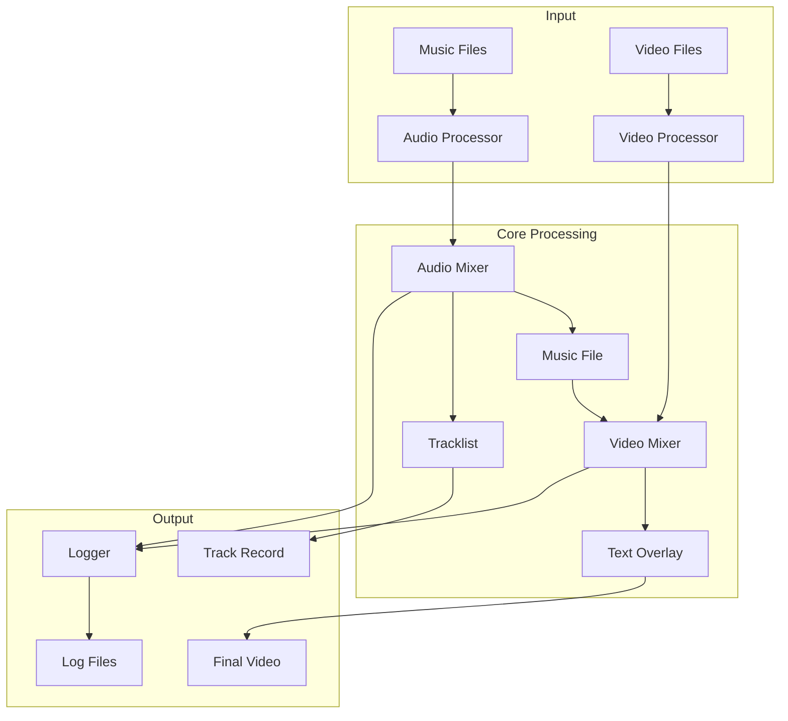
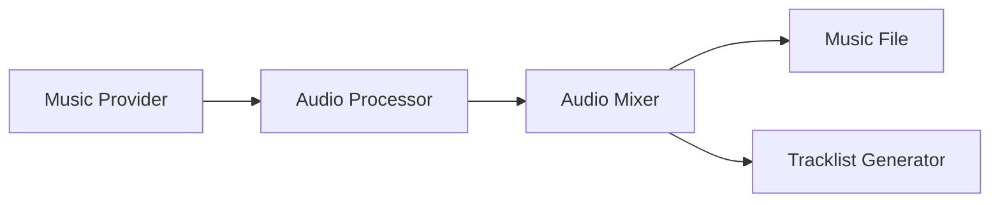
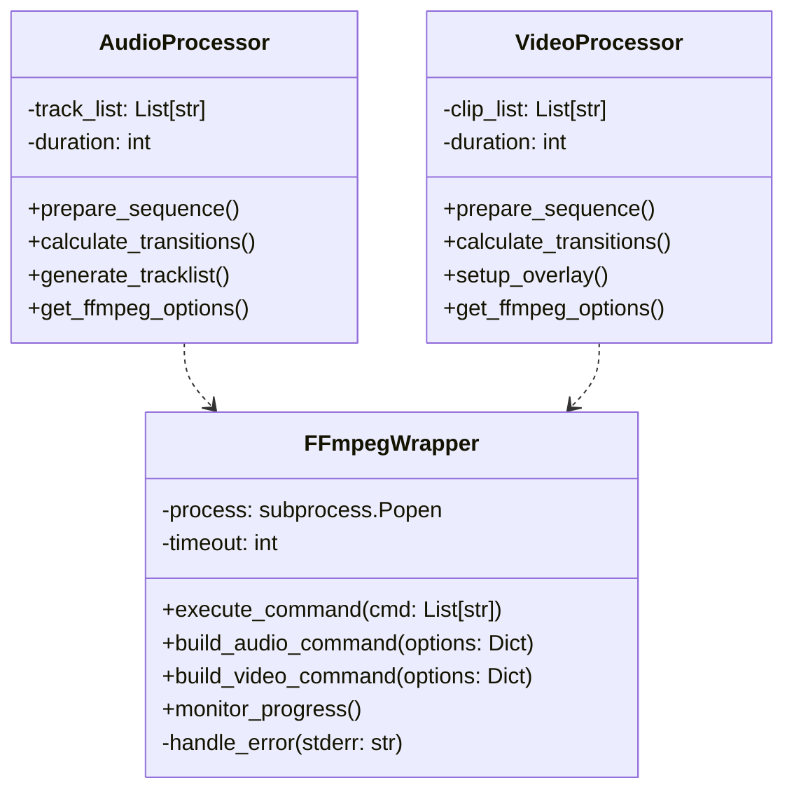
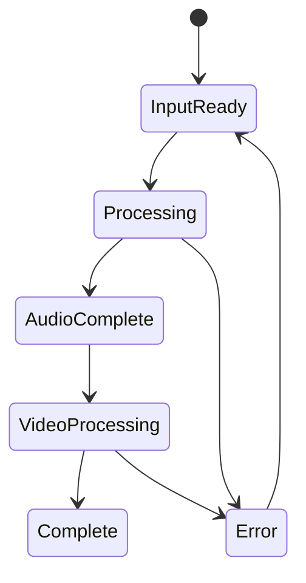

# System Patterns

Last Updated: 2025-03-07

## Purpose
This document outlines the system architecture, key technical decisions, design patterns in use, and component relationships.

## System Architecture


## Core Design Patterns
### Factory Pattern
- AudioProcessorFactory for audio handling
- VideoProcessorFactory for video handling
- TransitionFactory for effect management

### Strategy Pattern
- Different transition strategies
- Various text overlay styles
- Multiple logging levels

### Observer Pattern
- Progress monitoring
- Event logging
- State changes notification

## Component Relationships
### Audio Processing Chain


### Video Processing Chain


## Technical Decisions
### Python as Core Language
- Strong multimedia processing libraries
- Excellent ffmpeg bindings
- Good testing frameworks
- Cloud deployment ready

### File-Based Architecture
- Clear separation of input/output
- Easy to test and verify
- Cloud storage compatible
- Simple state management

### ffmpeg Integration
#### Core Architecture


#### Implementation Strategy
```python
import subprocess
import logging
import os
from src.config import Config

logger = logging.getLogger(__name__)

class FFmpegWrapper:
    """
    A wrapper class for FFmpeg functionality.
    """

    def __init__(self, ffmpeg_path=None, ffprobe_path=None, timeout=None):
        """
        Initializes the FFmpegWrapper with the paths to the FFmpeg and FFprobe executables.
        If no paths are provided, it uses the paths defined in the Config class.
        Args:
            ffmpeg_path (str, optional): Path to the FFmpeg executable. Defaults to None.
            ffprobe_path (str, optional): Path to the FFprobe executable. Defaults to None.
            timeout (int, optional): Timeout in seconds for FFmpeg commands. Defaults to None.
        """
        self.ffmpeg_path = ffmpeg_path or str(Config.FFMPEG_PATH)
        self.ffprobe_path = ffprobe_path or str(Config.FFPROBE_PATH)
        self.timeout = timeout

    def _run_command(self, command):
        """
        Runs an FFmpeg command using subprocess.

        Args:
            command (list): A list of strings representing the FFmpeg command.

        Returns:
            bool: True if the command was successful, False otherwise.
        """
        try:
            logger.info(f"Running command: {' '.join(command)}")
            result = subprocess.run(
                command,
                stdout=subprocess.PIPE,
                stderr=subprocess.PIPE,
                text=True,
                timeout=self.timeout
            )
            logger.info(result.stdout)
            if result.returncode != 0:
                logger.error(f"FFmpeg command failed with error: {result.stderr}")
                return None
            return result
        except FileNotFoundError:
            logger.error("FFmpeg executable not found. Please ensure FFmpeg is installed and the path is configured correctly.")
            return None
        except subprocess.TimeoutExpired as e:
            logger.error(f"FFmpeg command timed out after {self.timeout} seconds.")
            raise
        except Exception as e:
            logger.error(f"An unexpected error occurred: {e}")
            return None

    def encode_video(self, input_file, output_file, options=None):
        """
        Encodes a video file.

        Args:
            input_file (str): Path to the input video file.
            output_file (str): Path to the output video file.
            options (dict, optional): Dictionary of encoding options. Defaults to None.

        Returns:
            bool: True if the encoding was successful, False otherwise.
        """
        command = [self.ffmpeg_path]  # -y to overwrite output file
        
        # If input_file is a raw FFmpeg input (like "testsrc=duration=1..."), don't use -i
        if not os.path.exists(input_file):
            command.extend(["-f", "lavfi", "-i", input_file])
        else:
            command.extend(['-i', input_file])
            
        if options:
            for key, value in options.items():
                command.extend([f"-{key}", str(value)])
        command.extend(['-y', output_file]) # -y to overwrite output file
        return self._run_command(command)

    def concat_video(self, input_files, output_file, options=None):
        """
        Concatenates multiple video clips.

        Args:
            input_files (list): List of paths to the input video files.
            output_file (str): Path to the output video file.
            options (dict, optional): Dictionary of concatenation options. Defaults to None.

        Returns:
            bool: True if the concatenation was successful, False otherwise.
        """
        # Create a temporary concat file
        concat_file = "concat.txt"
        try:
            with open(concat_file, "w") as f:
                for file in input_files:
                    f.write(f"file '{file}'\n")

            command = [
                self.ffmpeg_path,
                "-f",
                "concat",
                "-safe",
                "0",  # Required for relative paths
                "-i",
                concat_file,
                "-c",
                "copy",  # Copy streams directly
                "-y", # Overwrite output file if it exists
                output_file,
            ]
            if options:
                for key, value in options.items():
                    command.extend([f"-{key}", str(value)])
            success = self._run_command(command)
        finally:
            # Clean up the temporary concat file
            import os
            if os.path.exists(concat_file):
                os.remove(concat_file)
        return success

    def add_audio(self, input_file, audio_file, output_file, options=None):
        """
        Adds an audio track to a video file.

        Args:
            input_file (str): Path to the input video file.
            audio_file (str): Path to the audio file.
            output_file (str): Path to the output video file.
            options (dict, optional): Dictionary of audio adding options. Defaults to None.

        Returns:
            bool: True if the audio adding was successful, False otherwise.
        """
        command = [self.ffmpeg_path, '-i', input_file, '-i', audio_file, '-c', 'copy', '-map', '0:v', '-map', '1:a', '-shortest', '-y']
        if options:
            for key, value in options.items():
                command.extend([f"-{key}", str(value)])
        command.append(output_file)
        return self._run_command(command)

    def apply_filter(self, input_file, output_file, filter_name, options=None):
        """
        Applies a video filter to a video file.

        Args:
            input_file (str): Path to the input video file.
            output_file (str): Path to the output video file.
            filter_name (str): Name of the filter to apply.
            options (dict, optional): Dictionary of filter options. Defaults to None.

        Returns:
            bool: True if the filter application was successful, False otherwise.
        """
        command = [self.ffmpeg_path, '-i', input_file, '-vf', filter_name, '-y']
        if options:
            for key, value in options.items():
                command.extend([f"-{key}", str(value)])
        command.append(output_file)
        return self._run_command(command)

    def test_timeout_command(self, timeout):
        """
        Test timeout with a simple sleep command.

        Args:
            timeout (int): Timeout in seconds.

        Returns:
            bool: True if the command was successful, False otherwise.
        """
        command = ['python', '-c', 'import time; time.sleep(10)']
        self.timeout = timeout
        return self._run_command(command)

    def extract_audio(self, input_file, output_file, options=None):
        """
        Extracts the audio track from a video file.

        Args:
            input_file (str): Path to the input video file.
            output_file (str): Path to the output audio file.
            options (dict, optional): Dictionary of extraction options. Defaults to None.

        Returns:
            bool: True if the audio extraction was successful, False otherwise.
        """
        command = [self.ffmpeg_path, '-i', input_file, '-vn', '-acodec', 'pcm_s16le', '-f', 'wav', '-y']
        if options:
            for key, value in options.items():
                command.extend([f"-{key}", str(value)])
        command.append(output_file)
        return self._run_command(command)

    def get_video_dimensions(self, file_path):
        """
        Gets the dimensions of a video file using ffprobe.

        Args:
            file_path (str): Path to the video file.

        Returns:
            tuple: A tuple containing (width, height) of the video, or None if an error occurs.
        """
        try:
            command = [
                self.ffprobe_path,
                "-v", "error",
                "-select_streams", "v:0",
                "-show_entries", "stream=width,height",
                "-of", "json",
                file_path
            ]
            
            result = subprocess.run(command, capture_output=True, text=True, check=True)
            import json
            data = json.loads(result.stdout)
            width = int(data["streams"][0]["width"])
            height = int(data["streams"][0]["height"])
            return width, height
        except Exception as e:
            logger.error(f"Error getting video dimensions: {e}")
            return None
```
# System Patterns

Last Updated: 2025-03-07

## Purpose
This document outlines the system architecture, key technical decisions, design patterns in use, and component relationships.

## System Architecture


## Core Design Patterns
### Factory Pattern
- AudioProcessorFactory for audio handling
- VideoProcessorFactory for video handling
- TransitionFactory for effect management

### Strategy Pattern
- Different transition strategies
- Various text overlay styles
- Multiple logging levels

### Observer Pattern
- Progress monitoring
- Event logging
- State changes notification

## Component Relationships
### Audio Processing Chain


### Video Processing Chain


## Technical Decisions
### Python as Core Language
- Strong multimedia processing libraries
- Excellent ffmpeg bindings
- Good testing frameworks
- Cloud deployment ready

### File-Based Architecture
- Clear separation of input/output
- Easy to test and verify
- Cloud storage compatible
- Simple state management

### ffmpeg Integration
#### Core Architecture


#### Implementation Strategy
```python
import subprocess
import logging
import os
from src.config import Config

logger = logging.getLogger(__name__)

class FFmpegWrapper:
    """
    A wrapper class for FFmpeg functionality.
    """

    def __init__(self, ffmpeg_path=None, ffprobe_path=None, timeout=None):
        """
        Initializes the FFmpegWrapper with the paths to the FFmpeg and FFprobe executables.
        If no paths are provided, it uses the paths defined in the Config class.
        Args:
            ffmpeg_path (str, optional): Path to the FFmpeg executable. Defaults to None.
            ffprobe_path (str, optional): Path to the FFprobe executable. Defaults to None.
            timeout (int, optional): Timeout in seconds for FFmpeg commands. Defaults to None.
        """
        self.ffmpeg_path = ffmpeg_path or str(Config.FFMPEG_PATH)
        self.ffprobe_path = ffprobe_path or str(Config.FFPROBE_PATH)
        self.timeout = timeout

    def _run_command(self, command):
        """
        Runs an FFmpeg command using subprocess.

        Args:
            command (list): A list of strings representing the FFmpeg command.

        Returns:
            bool: True if the command was successful, False otherwise.
        """
        try:
            logger.info(f"Running command: {' '.join(command)}")
            result = subprocess.run(
                command,
                stdout=subprocess.PIPE,
                stderr=subprocess.PIPE,
                text=True,
                timeout=self.timeout
            )
            logger.info(result.stdout)
            if result.returncode != 0:
                logger.error(f"FFmpeg command failed with error: {result.stderr}")
                return None
            return result
        except FileNotFoundError:
            logger.error("FFmpeg executable not found. Please ensure FFmpeg is installed and the path is configured correctly.")
            return None
        except subprocess.TimeoutExpired as e:
            logger.error(f"FFmpeg command timed out after {self.timeout} seconds.")
            raise
        except Exception as e:
            logger.error(f"An unexpected error occurred: {e}")
            return None

    def encode_video(self, input_file, output_file, options=None):
        """
        Encodes a video file.

        Args:
            input_file (str): Path to the input video file.
            output_file (str): Path to the output video file.
            options (dict, optional): Dictionary of encoding options. Defaults to None.

        Returns:
            bool: True if the encoding was successful, False otherwise.
        """
        command = [self.ffmpeg_path]  # -y to overwrite output file
        
        # If input_file is a raw FFmpeg input (like "testsrc=duration=1..."), don't use -i
        if not os.path.exists(input_file):
            command.extend(["-f", "lavfi", "-i", input_file])
        else:
            command.extend(['-i', input_file])
            
        if options:
            for key, value in options.items():
                command.extend([f"-{key}", str(value)])
        command.extend(['-y', output_file]) # -y to overwrite output file
        return self._run_command(command)

    def concat_video(self, input_files, output_file, options=None):
        """
        Concatenates multiple video clips.

        Args:
            input_files (list): List of paths to the input video files.
            output_file (str): Path to the output video file.
            options (dict, optional): Dictionary of concatenation options. Defaults to None.

        Returns:
            bool: True if the concatenation was successful, False otherwise.
        """
        # Create a temporary concat file
        concat_file = "concat.txt"
        try:
            with open(concat_file, "w") as f:
                for file in input_files:
                    f.write(f"file '{file}'\n")

            command = [
                self.ffmpeg_path,
                "-f",
                "concat",
                "-safe",
                "0",  # Required for relative paths
                "-i",
                concat_file,
                "-c",
                "copy",  # Copy streams directly
                "-y", # Overwrite output file if it exists
                output_file,
            ]
            if options:
                for key, value in options.items():
                    command.extend([f"-{key}", str(value)])
            success = self._run_command(command)
        finally:
            # Clean up the temporary concat file
            import os
            if os.path.exists(concat_file):
                os.remove(concat_file)
        return success

    def add_audio(self, input_file, audio_file, output_file, options=None):
        """
        Adds an audio track to a video file.

        Args:
            input_file (str): Path to the input video file.
            audio_file (str): Path to the audio file.
            output_file (str): Path to the output video file.
            options (dict, optional): Dictionary of audio adding options. Defaults to None.

        Returns:
            bool: True if the audio adding was successful, False otherwise.
        """
        command = [self.ffmpeg_path, '-i', input_file, '-i', audio_file, '-c', 'copy', '-map', '0:v', '-map', '1:a', '-shortest', '-y']
        if options:
            for key, value in options.items():
                command.extend([f"-{key}", str(value)])
        command.append(output_file)
        return self._run_command(command)

    def apply_filter(self, input_file, output_file, filter_name, options=None):
        """
        Applies a video filter to a video file.

        Args:
            input_file (str): Path to the input video file.
            output_file (str): Path to the output video file.
            filter_name (str): Name of the filter to apply.
            options (dict, optional): Dictionary of filter options. Defaults to None.

        Returns:
            bool: True if the filter application was successful, False otherwise.
        """
        command = [self.ffmpeg_path, '-i', input_file, '-vf', filter_name, '-y']
        if options:
            for key, value in options.items():
                command.extend([f"-{key}", str(value)])
        command.append(output_file)
        return self._run_command(command)

    def test_timeout_command(self, timeout):
        """
        Test timeout with a simple sleep command.

        Args:
            timeout (int): Timeout in seconds.

        Returns:
            bool: True if the command was successful, False otherwise.
        """
        command = ['python', '-c', 'import time; time.sleep(10)']
        self.timeout = timeout
        return self._run_command(command)

    def extract_audio(self, input_file, output_file, options=None):
        """
        Extracts the audio track from a video file.

        Args:
            input_file (str): Path to the input video file.
            output_file (str): Path to the output audio file.
            options (dict, optional): Dictionary of extraction options. Defaults to None.

        Returns:
            bool: True if the audio extraction was successful, False otherwise.
        """
        command = [self.ffmpeg_path, '-i', input_file, '-vn', '-acodec', 'pcm_s16le', '-f', 'wav', '-y']
        if options:
            for key, value in options.items():
                command.extend([f"-{key}", str(value)])
        command.append(output_file)
        return self._run_command(command)

    def get_video_dimensions(self, file_path):
        """
        Gets the dimensions of a video file using ffprobe.

        Args:
            file_path (str): Path to the video file.

        Returns:
            tuple: A tuple containing (width, height) of the video, or None if an error occurs.
        """
        try:
            command = [
                self.ffprobe_path,
                "-v", "error",
                "-select_streams", "v:0",
                "-show_entries", "stream=width,height",
                "-of", "json",
                file_path
            ]
            
            result = subprocess.run(command, capture_output=True, text=True, check=True)
            import json
            data = json.loads(result.stdout)
            width = int(data["streams"][0]["width"])
            height = int(data["streams"][0]["height"])
            return width, height
        except Exception as e:
            logger.error(f"Error getting video dimensions: {e}")
            return None
```

#### Separation of Concerns
1. FFmpegWrapper
   - All FFmpeg command construction
   - Process management
   - GPU acceleration handling
   - Error management

2. AudioProcessor
   - Track sequence management
   - Transition timing
   - Metadata handling
   - No direct FFmpeg calls

3. VideoProcessor
   - Clip sequence management
   - Visual transitions
   - Overlay handling
   - No direct FFmpeg calls

#### Performance Optimizations
1. Video Encoding
   - libx264 with optimized settings
   - CRF-based quality control
   - Film-tuned encoding
   - Web playback optimization

2. Resource Management
   - Chunked processing
   - Stream copying
   - Memory-aware operations

#### Error Handling
- Centralized in FFmpegWrapper
- Process cleanup guaranteed
- GPU support detection
- Structured error reporting

## Data Flow
### Audio Pipeline
1. Scan music directory
2. Randomize track order
3. Process audio metadata
4. Generate transitions
5. Create unified track
6. Generate tracklist

### Video Pipeline
1. Scan clips directory
2. Create clip sequence
3. Apply transitions
4. Overlay track names
5. Generate final video

## State Management
### File System States


## Error Handling
### Recovery Strategies
- Input validation before processing
- Temporary file cleanup
- Partial progress preservation
- Detailed error logging

### Error Types
- Input file errors
- Processing failures
- Resource constraints
- Integration issues

## Performance Considerations
- Batch process audio files
- Stream video processing
- Minimize file operations
- Optimize memory usage
- Use ffmpeg hardware acceleration

## Security Patterns
- Input file validation
- Resource usage limits
- Secure file operations
- Clean error messages
- Safe external calls

## Testing Strategy
### Unit Testing
- Component isolation
- Mock file operations
- Test configurations
- Error conditions

### Integration Testing
- End-to-end flows
- File handling
- ffmpeg integration
- Performance metrics

### Test Coverage Goals
- Core logic: 90%+
- File handlers: 85%+
- Integration points: 80%+

## Notes
- This document should reflect current implementation patterns
- Update when introducing new patterns or changing existing ones
- Architecture decisions here should align with techContext.md
# System Patterns

Last Updated: 2025-03-07

## Purpose
This document outlines the system architecture, key technical decisions, design patterns in use, and component relationships.

## System Architecture


## Core Design Patterns
### Factory Pattern
- AudioProcessorFactory for audio handling
- VideoProcessorFactory for video handling
- TransitionFactory for effect management

### Strategy Pattern
- Different transition strategies
- Various text overlay styles
- Multiple logging levels

### Observer Pattern
- Progress monitoring
- Event logging
- State changes notification

## Component Relationships
### Audio Processing Chain


### Video Processing Chain


## Technical Decisions
### Python as Core Language
- Strong multimedia processing libraries
- Excellent ffmpeg bindings
- Good testing frameworks
- Cloud deployment ready

### File-Based Architecture
- Clear separation of input/output
- Easy to test and verify
- Cloud storage compatible
- Simple state management

### ffmpeg Integration
#### Core Architecture


#### Implementation Strategy
```python
import subprocess
import logging
import os
from src.config import Config

logger = logging.getLogger(__name__)

class FFmpegWrapper:
    """
    A wrapper class for FFmpeg functionality.
    """

    def __init__(self, ffmpeg_path=None, ffprobe_path=None, timeout=None):
        """
        Initializes the FFmpegWrapper with the paths to the FFmpeg and FFprobe executables.
        If no paths are provided, it uses the paths defined in the Config class.
        Args:
            ffmpeg_path (str, optional): Path to the FFmpeg executable. Defaults to None.
            ffprobe_path (str, optional): Path to the FFprobe executable. Defaults to None.
            timeout (int, optional): Timeout in seconds for FFmpeg commands. Defaults to None.
        """
        self.ffmpeg_path = ffmpeg_path or str(Config.FFMPEG_PATH)
        self.ffprobe_path = ffprobe_path or str(Config.FFPROBE_PATH)
        self.timeout = timeout

    def _run_command(self, command):
        """
        Runs an FFmpeg command using subprocess.

        Args:
            command (list): A list of strings representing the FFmpeg command.

        Returns:
            bool: True if the command was successful, False otherwise.
        """
        try:
            logger.info(f"Running command: {' '.join(command)}")
            result = subprocess.run(
                command,
                stdout=subprocess.PIPE,
                stderr=subprocess.PIPE,
                text=True,
                timeout=self.timeout
            )
            logger.info(result.stdout)
            if result.returncode != 0:
                logger.error(f"FFmpeg command failed with error: {result.stderr}")
                return None
            return result
        except FileNotFoundError:
            logger.error("FFmpeg executable not found. Please ensure FFmpeg is installed and the path is configured correctly.")
            return None
        except subprocess.TimeoutExpired as e:
            logger.error(f"FFmpeg command timed out after {self.timeout} seconds.")
            raise
        except Exception as e:
            logger.error(f"An unexpected error occurred: {e}")
            return None

    def encode_video(self, input_file, output_file, options=None):
        """
        Encodes a video file.

        Args:
            input_file (str): Path to the input video file.
            output_file (str): Path to the output video file.
            options (dict, optional): Dictionary of encoding options. Defaults to None.

        Returns:
            bool: True if the encoding was successful, False otherwise.
        """
        command = [self.ffmpeg_path]  # -y to overwrite output file
        
        # If input_file is a raw FFmpeg input (like "testsrc=duration=1..."), don't use -i
        if not os.path.exists(input_file):
            command.extend(["-f", "lavfi", "-i", input_file])
        else:
            command.extend(['-i', input_file])
            
        if options:
            for key, value in options.items():
                command.extend([f"-{key}", str(value)])
        command.extend(['-y', output_file]) # -y to overwrite output file
        return self._run_command(command)

    def concat_video(self, input_files, output_file, options=None):
        """
        Concatenates multiple video clips.

        Args:
            input_files (list): List of paths to the input video files.
            output_file (str): Path to the output video file.
            options (dict, optional): Dictionary of concatenation options. Defaults to None.

        Returns:
            bool: True if the concatenation was successful, False otherwise.
        """
        # Create a temporary concat file
        concat_file = "concat.txt"
        try:
            with open(concat_file, "w") as f:
                for file in input_files:
                    f.write(f"file '{file}'\n")

            command = [
                self.ffmpeg_path,
                "-f",
                "concat",
                "-safe",
                "0",  # Required for relative paths
                "-i",
                concat_file,
                "-c",
                "copy",  # Copy streams directly
                "-y", # Overwrite output file if it exists
                output_file,
            ]
            if options:
                for key, value in options.items():
                    command.extend([f"-{key}", str(value)])
            success = self._run_command(command)
        finally:
            # Clean up the temporary concat file
            import os
            if os.path.exists(concat_file):
                os.remove(concat_file)
        return success

    def add_audio(self, input_file, audio_file, output_file, options=None):
        """
        Adds an audio track to a video file.

        Args:
            input_file (str): Path to the input video file.
            audio_file (str): Path to the audio file.
            output_file (str): Path to the output video file.
            options (dict, optional): Dictionary of audio adding options. Defaults to None.

        Returns:
            bool: True if the audio adding was successful, False otherwise.
        """
        command = [self.ffmpeg_path, '-i', input_file, '-i', audio_file, '-c', 'copy', '-map', '0:v', '-map', '1:a', '-shortest', '-y']
        if options:
            for key, value in options.items():
                command.extend([f"-{key}", str(value)])
        command.append(output_file)
        return self._run_command(command)

    def apply_filter(self, input_file, output_file, filter_name, options=None):
        """
        Applies a video filter to a video file.

        Args:
            input_file (str): Path to the input video file.
            output_file (str): Path to the output video file.
            filter_name (str): Name of the filter to apply.
            options (dict, optional): Dictionary of filter options. Defaults to None.

        Returns:
            bool: True if the filter application was successful, False otherwise.
        """
        command = [self.ffmpeg_path, '-i', input_file, '-vf', filter_name, '-y']
        if options:
            for key, value in options.items():
                command.extend([f"-{key}", str(value)])
        command.append(output_file)
        return self._run_command(command)

    def test_timeout_command(self, timeout):
        """
        Test timeout with a simple sleep command.

        Args:
            timeout (int): Timeout in seconds.

        Returns:
            bool: True if the command was successful, False otherwise.
        """
        command = ['python', '-c', 'import time; time.sleep(10)']
        self.timeout = timeout
        return self._run_command(command)

    def extract_audio(self, input_file, output_file, options=None):
        """
        Extracts the audio track from a video file.

        Args:
            input_file (str): Path to the input video file.
            output_file (str): Path to the output audio file.
            options (dict, optional): Dictionary of extraction options. Defaults to None.

        Returns:
            bool: True if the audio extraction was successful, False otherwise.
        """
        command = [self.ffmpeg_path, '-i', input_file, '-vn', '-acodec', 'pcm_s16le', '-f', 'wav', '-y']
        if options:
            for key, value in options.items():
                command.extend([f"-{key}", str(value)])
        command.append(output_file)
        return self._run_command(command)

    def get_video_dimensions(self, file_path):
        """
        Gets the dimensions of a video file using ffprobe.

        Args:
            file_path (str): Path to the video file.

        Returns:
            tuple: A tuple containing (width, height) of the video, or None if an error occurs.
        """
        try:
            command = [
                self.ffprobe_path,
                "-v", "error",
                "-select_streams", "v:0",
                "-show_entries", "stream=width,height",
                "-of", "json",
                file_path
            ]
            
            result = subprocess.run(command, capture_output=True, text=True, check=True)
            import json
            data = json.loads(result.stdout)
            width = int(data["streams"][0]["width"])
            height = int(data["streams"][0]["height"])
            return width, height
        except Exception as e:
            logger.error(f"Error getting video dimensions: {e}")
            return None
```
# System Patterns

Last Updated: 2025-03-07

## Purpose
This document outlines the system architecture, key technical decisions, design patterns in use, and component relationships.

## System Architecture


## Core Design Patterns
### Factory Pattern
- AudioProcessorFactory for audio handling
- VideoProcessorFactory for video handling
- TransitionFactory for effect management

### Strategy Pattern
- Different transition strategies
- Various text overlay styles
- Multiple logging levels

### Observer Pattern
- Progress monitoring
- Event logging
- State changes notification

## Component Relationships
### Audio Processing Chain


### Video Processing Chain


## Technical Decisions
### Python as Core Language
- Strong multimedia processing libraries
- Excellent ffmpeg bindings
- Good testing frameworks
- Cloud deployment ready

### File-Based Architecture
- Clear separation of input/output
- Easy to test and verify
- Cloud storage compatible
- Simple state management

### ffmpeg Integration
#### Core Architecture


#### Implementation Strategy
```python
class FFmpegWrapper:
    """Central FFmpeg operations manager"""
    def __init__(self, timeout=None):
        self.process = None
        self.timeout = timeout
        self.gpu_enabled = self._check_gpu_support()

    def build_audio_command(self, options):
        """Constructs FFmpeg command for audio processing"""
        return [
            'ffmpeg',
            '-f', 'concat',
            '-safe', '0',
            '-i', options['input_list'],
            '-c', 'copy',
            options['output_file']
        ]
    
    def build_video_command(self, options):
        """Constructs FFmpeg command with optimized H.264 encoding"""
        return [
            'ffmpeg',
            '-i', options['input_file'],
            '-c:v', 'libx264',
            '-preset', options.get('preset', 'medium'),
            '-crf', '23',
            '-tune', 'film',
            '-movflags', '+faststart',
            '-profile:v', 'high',
            '-level', '4.1',
            options['output_file']
        ]

    def execute_command(self, cmd):
        try:
            self.process = subprocess.Popen(
                cmd,
                stdout=subprocess.PIPE,
                stderr=subprocess.PIPE,
                preexec_fn=os.setsid
            )
            return self.process.communicate(timeout=self.timeout)
        except Exception as e:
            if self.process and self.process.poll() is None:
                os.killpg(os.getpgid(self.process.pid), signal.SIGTERM)
            raise
```

#### Separation of Concerns
1. FFmpegWrapper
   - All FFmpeg command construction
   - Process management
   - GPU acceleration handling
   - Error management

2. AudioProcessor
   - Track sequence management
   - Transition timing
   - Metadata handling
   - No direct FFmpeg calls

3. VideoProcessor
   - Clip sequence management
   - Visual transitions
   - Overlay handling
   - No direct FFmpeg calls

#### Performance Optimizations
1. Video Encoding
   - libx264 with optimized settings
   - CRF-based quality control
   - Film-tuned encoding
   - Web playback optimization

2. Resource Management
   - Chunked processing
   - Stream copying
   - Memory-aware operations

#### Error Handling
- Centralized in FFmpegWrapper
- Process cleanup guaranteed
- GPU support detection
- Structured error reporting

## Data Flow
### Audio Pipeline
1. Scan music directory
2. Randomize track order
3. Process audio metadata
4. Generate transitions
5. Create unified track
6. Generate tracklist

### Video Pipeline
1. Scan clips directory
2. Create clip sequence
3. Apply transitions
4. Overlay track names
5. Generate final video

## State Management
### File System States


## Error Handling
### Recovery Strategies
- Input validation before processing
- Temporary file cleanup
- Partial progress preservation
- Detailed error logging

### Error Types
- Input file errors
- Processing failures
- Resource constraints
- Integration issues

## Performance Considerations
- Batch process audio files
- Stream video processing
- Minimize file operations
- Optimize memory usage
- Use ffmpeg hardware acceleration

## Security Patterns
- Input file validation
- Resource usage limits
- Secure file operations
- Clean error messages
- Safe external calls

## Testing Strategy
### Unit Testing
- Component isolation
- Mock file operations
- Test configurations
- Error conditions

### Integration Testing
- End-to-end flows
- File handling
- ffmpeg integration
- Performance metrics

### Test Coverage Goals
- Core logic: 90%+
- File handlers: 85%+
- Integration points: 80%+

## Notes
- This document should reflect current implementation patterns
- Update when introducing new patterns or changing existing ones
- Architecture decisions here should align with techContext.md
