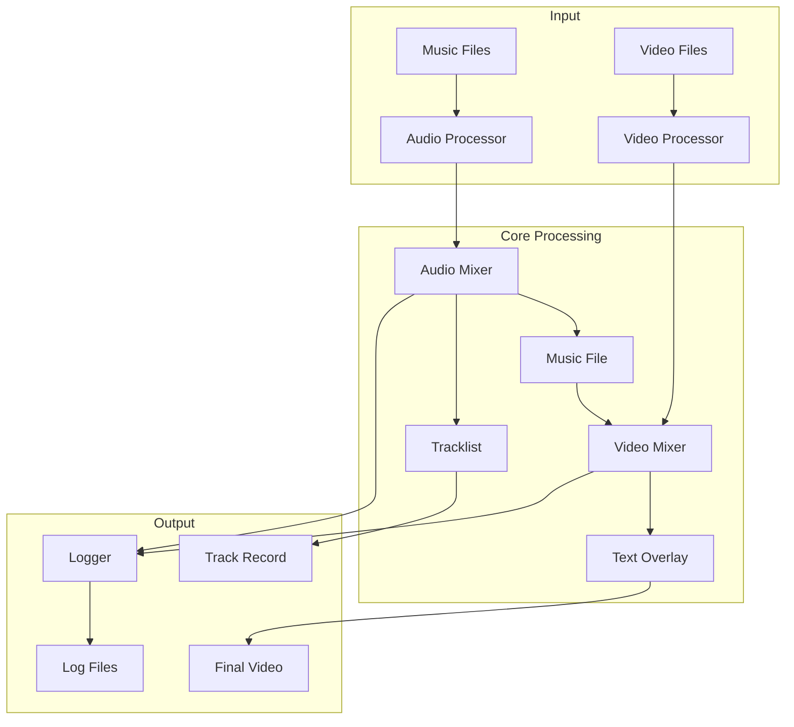
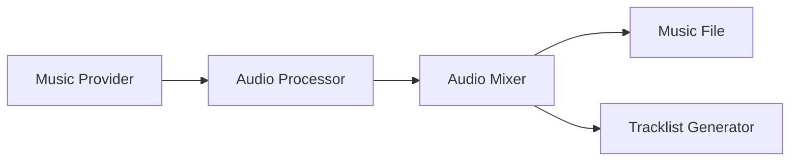
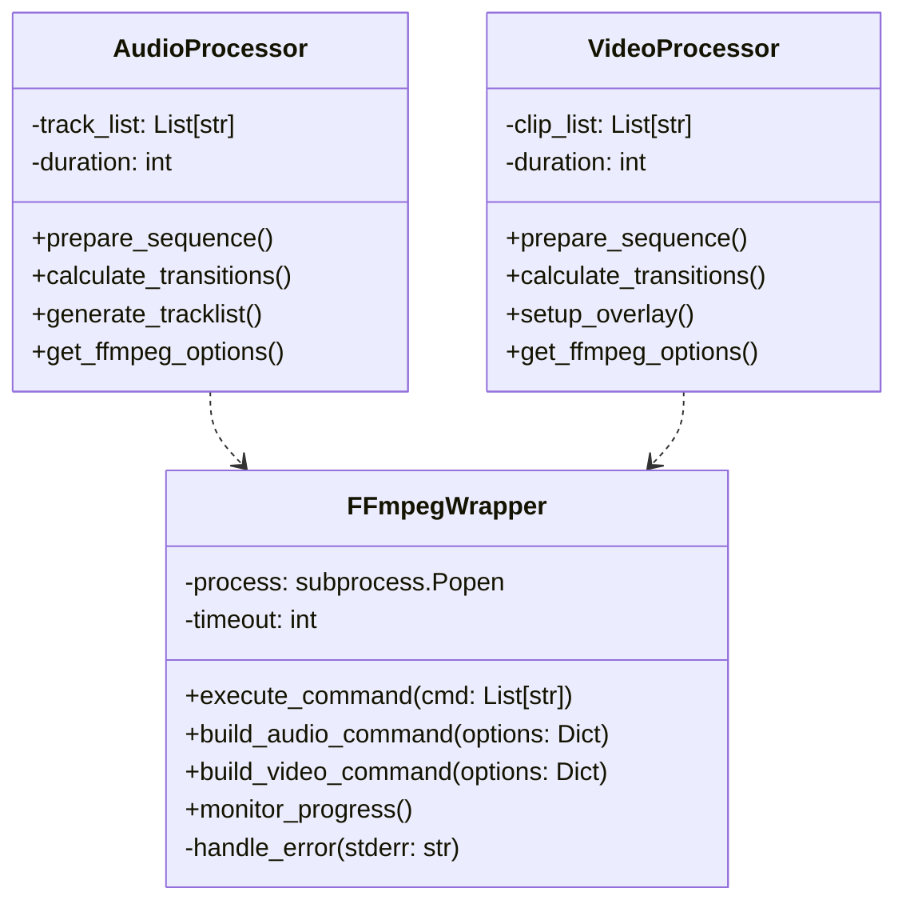
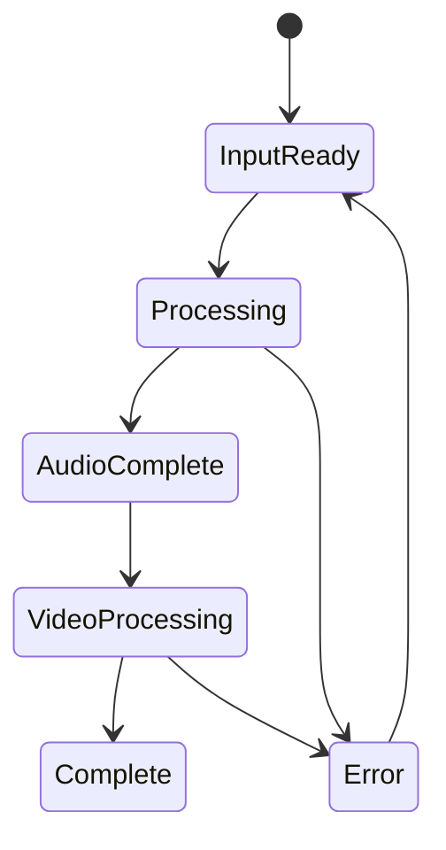

# System Patterns

Last Updated: 2025-03-07

## Purpose
This document outlines the system architecture, key technical decisions, design patterns in use, and component relationships.

## System Architecture


## Core Design Patterns
### Factory Pattern
- AudioProcessorFactory for audio handling
- VideoProcessorFactory for video handling
- TransitionFactory for effect management

### Strategy Pattern
- Different transition strategies
- Various text overlay styles
- Multiple logging levels

### Observer Pattern
- Progress monitoring
- Event logging
- State changes notification

## Component Relationships
### Audio Processing Chain


### Video Processing Chain


## Technical Decisions
### Python as Core Language
- Strong multimedia processing libraries
- Excellent ffmpeg bindings
- Good testing frameworks
- Cloud deployment ready

### File-Based Architecture
- Clear separation of input/output
- Easy to test and verify
- Cloud storage compatible
- Simple state management

### ffmpeg Integration
#### Core Architecture


#### Implementation Strategy
```python
class FFmpegWrapper:
    """Central FFmpeg operations manager"""
    def __init__(self, timeout=None):
        self.process = None
        self.timeout = timeout
        self.gpu_enabled = self._check_gpu_support()

    def build_audio_command(self, options):
        """Constructs FFmpeg command for audio processing"""
        return [
            'ffmpeg',
            '-f', 'concat',
            '-safe', '0',
            '-i', options['input_list'],
            '-c', 'copy',
            options['output_file']
        ]
    
    def build_video_command(self, options):
        """Constructs FFmpeg command with optimized H.264 encoding"""
        return [
            'ffmpeg',
            '-i', options['input_file'],
            '-c:v', 'libx264',
            '-preset', options.get('preset', 'medium'),
            '-crf', '23',
            '-tune', 'film',
            '-movflags', '+faststart',
            '-profile:v', 'high',
            '-level', '4.1',
            options['output_file']
        ]

    def execute_command(self, cmd):
        try:
            self.process = subprocess.Popen(
                cmd,
                stdout=subprocess.PIPE,
                stderr=subprocess.PIPE,
                preexec_fn=os.setsid
            )
            return self.process.communicate(timeout=self.timeout)
        except Exception as e:
            if self.process and self.process.poll() is None:
                os.killpg(os.getpgid(self.process.pid), signal.SIGTERM)
            raise
```

#### Separation of Concerns
1. FFmpegWrapper
   - All FFmpeg command construction
   - Process management
   - GPU acceleration handling
   - Error management

2. AudioProcessor
   - Track sequence management
   - Transition timing
   - Metadata handling
   - No direct FFmpeg calls

3. VideoProcessor
   - Clip sequence management
   - Visual transitions
   - Overlay handling
   - No direct FFmpeg calls

#### Performance Optimizations
1. Video Encoding
   - libx264 with optimized settings
   - CRF-based quality control
   - Film-tuned encoding
   - Web playback optimization

2. Resource Management
   - Chunked processing
   - Stream copying
   - Memory-aware operations

#### Error Handling
- Centralized in FFmpegWrapper
- Process cleanup guaranteed
- GPU support detection
- Structured error reporting

## Data Flow
### Audio Pipeline
1. Scan music directory
2. Randomize track order
3. Process audio metadata
4. Generate transitions
5. Create unified track
6. Generate tracklist

### Video Pipeline
1. Scan clips directory
2. Create clip sequence
3. Apply transitions
4. Overlay track names
5. Generate final video

## State Management
### File System States


## Error Handling
### Recovery Strategies
- Input validation before processing
- Temporary file cleanup
- Partial progress preservation
- Detailed error logging

### Error Types
- Input file errors
- Processing failures
- Resource constraints
- Integration issues

## Performance Considerations
- Batch process audio files
- Stream video processing
- Minimize file operations
- Optimize memory usage
- Use ffmpeg hardware acceleration

## Security Patterns
- Input file validation
- Resource usage limits
- Secure file operations
- Clean error messages
- Safe external calls

## Testing Strategy
### Unit Testing
- Component isolation
- Mock file operations
- Test configurations
- Error conditions

### Integration Testing
- End-to-end flows
- File handling
- ffmpeg integration
- Performance metrics

### Test Coverage Goals
- Core logic: 90%+
- File handlers: 85%+
- Integration points: 80%+

## Notes
- This document should reflect current implementation patterns
- Update when introducing new patterns or changing existing ones
- Architecture decisions here should align with techContext.md
